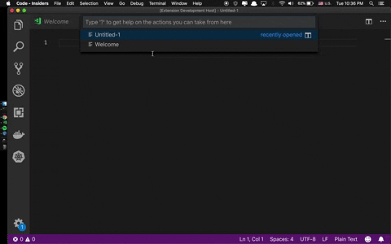

# Vscode-kwee-phyo-ipsum

Generates and inserts kwee phyo ipsum text into Visual Studio Code.

# Motivation

Getting Bored of traditional `သီဟိုဠ်မှ ဉာဏ်ကြီးရှင်သည် အာယုဝဍ္ဎနဆေးညွှန်းစာကို ဇလွန်ဈေးဘေး ဗာဒံပင်ထက် အဓိဋ္ဌာန်လျက် ဂဃနဏဖတ်ခဲ့သည်။` on placeholder for Burmese language. Why not we create placeholder excerpt sayings from beloved Yangon Region Chief Minister Phyo Min Thein (Kwee phyo)? 

**P.S** This plugin is just a plugin nothing related with any government agencies or organisations.And again please take the place holder texts as text. :v: :v:

# Confession

This project is inspired by [Vscode Lorem Ipsum](https://github.com/Tyriar/vscode-lorem-ipsum)
plugin.

# Install

1. Open VS Code
2. Press F1
3. Type "install"
4. Select "Extensions: Install Extension".
5. Select Kwee Phyo ipsum from the list

# Usage

Press F1 type Kwee Phyo and select to insert either a line or paragraph.

# Todo
- [ ]   Add more texts from other Burmese politicians 
- [ ]   Add excerpt quotes and speech as external lib dependency
- [ ]   Make Intellij Plugin 

# FAQs

Q : ZawGyi support ?

A : Definitely not.

Q : Backed by any government organisation ?

A : Definitely not.

Q : Any party supporter?

A : Hardcore **Char Party** Supporter.

# Sayings Credit
Special Thanks go to those websites where I can excerpt the sayings.

  - [Missumaburmese](http://www.mizzimaburmese.com/)
  - [Irrawaddy](https://burma.irrawaddy.com/)
  - [Eleven Myanmar](https://elevenmyanmar.com/)
  - [7daydaily](http://www.7daydaily.com/)
  - [Kumudranews](http://kumudranews.com/)

# Contributing

1. Fork it

2. Create your feature branch (`git checkout -b my-new-feature`)

3. Commit your changes (`git commit -am 'Added some feature'`)

4. Push to the branch (`git push origin my-new-feature`)

5. Create new Pull Request

# License

[MIT](http://www.opensource.org/licenses/MIT)

